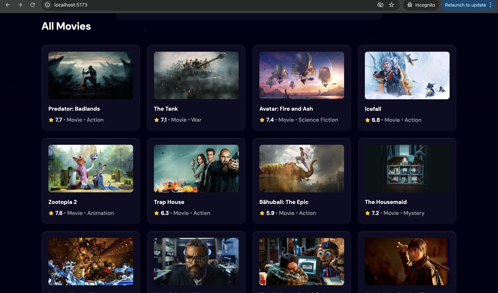
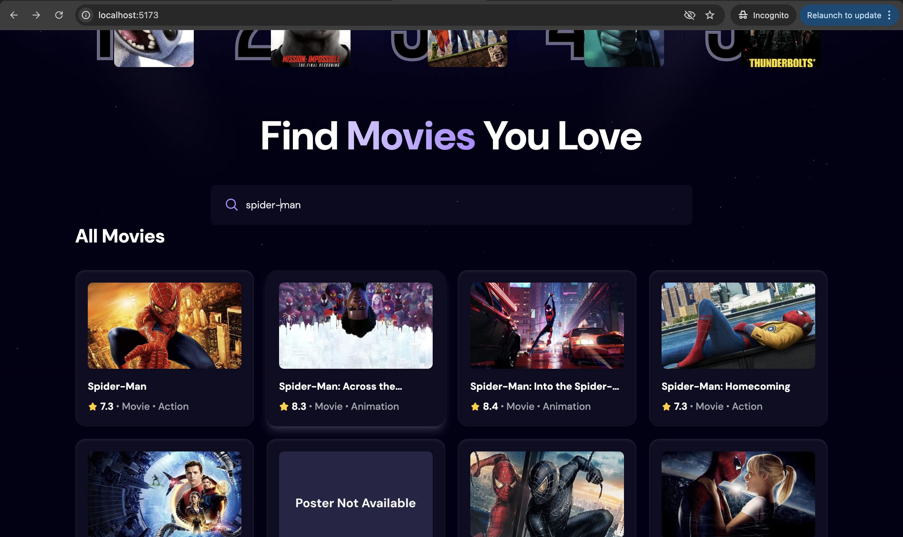
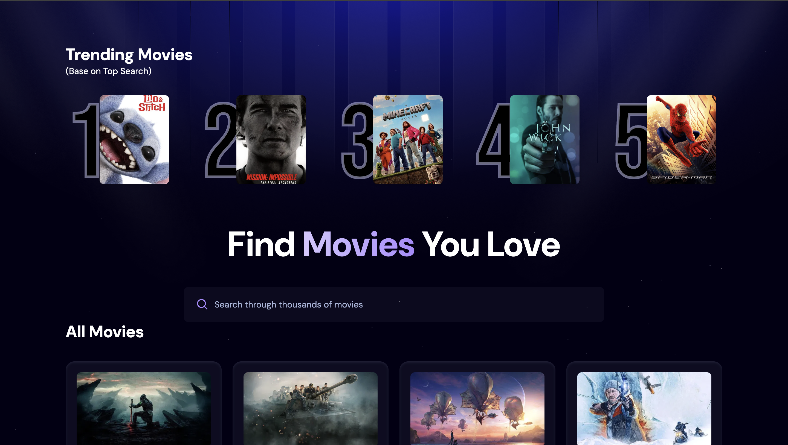

# Movie app
## 🔎 Overview

Movie App is a web application allows users to browse and search movies and TV shows.
Fetches data from the TMDB API so users can explore new releases, view details, and track trending titles easily.

## 🎯 Features

Display movie and TV show data from TMDB API

Search movies/TV shows by name with Debounce to reduce API calls

Store top search results and trending titles in the Appwrite database

## 🛠 Tech Stack

- Frontend: React.js, Tailwind CSS
- Backend / Database: Appwrite
- API: TMDB API

> This project is based on a tutorial, but I customized and extended it with my own features:
- Added Debounce for search to reduce API calls
- Connected to Appwrite database to store trending movies
- Improved UI using Tailwind CSS

## 🖼 Screenshots

### Browse Movies

### Search Results

### Trending Movies

## 💡 Notes

>This project is a practice / portfolio project
> Movie data is fetched from TMDB API
